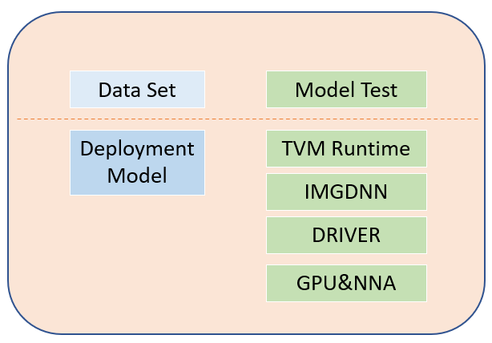
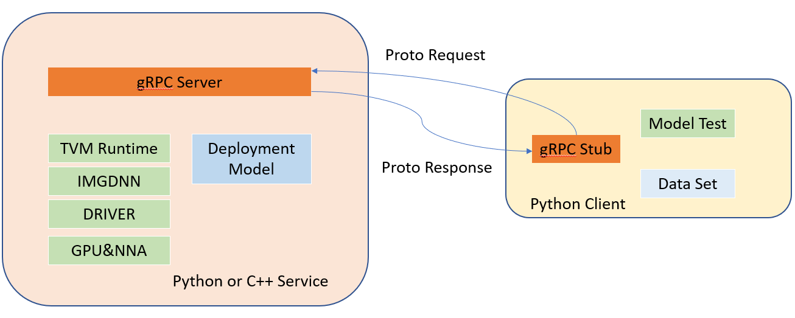

[简体中文](README_cn.md) | English

# powervr_paddle_model

## Introduction
This is an Imagination NCSDK enabled PaddlePaddle model zoo, which is part of [Hardware Ecosystem Co-Creation Program](https://www.imaginationtech.com/news/imagination-joins-baidu-paddlepaddle-hardware-ecosystem-co-creation-program/). Take devices that embedded with Imagination computing IPs(such as GPU and NNA) as target, PaddlePaddle inference model is compiled into deployment package utilizing Imagination [Neural Compute SDK(NCSDK)](https://developer.imaginationtech.com/ncsdk/). This repository includes deployment models and test code on these models.

### PaddlePaddle Models
We start from models in [PaddleClas](https://github.com/PaddlePaddle/PaddleClas), such as EfficientNet.

### Imagination HW & SW Tools
#### Hardware Platform
Only ROC1 from Unisoc is considered so far.<br>
HW: Unisoc ROC1

#### Neural Compute SDK
SW: NCSDK 2.8, NNA DDK 3.4, GPU DDK 1.17  

### Dependencies
The evaluation code are written in Python, which depend on following packages.
- pillow
- PyYAML
- numpy==1.19.5
- scipy==1.5.4
- scikit-learn==0.24.2

### Download Server
Deployment models and valset could be downloaded from ftp server.
sftp server: transfer.imgtec.com  
http client: https://transfer.imgtec.com  
user_name: imgchinalab_public  
password: public  

## Test System Overview
The test framework support inference mode or evalution mode. It could run the non-quantized PaddlePaddle model or the quantized PowerVR deployment models to evaluate quantization impacts. It also support distributed evaluation utilizing gRPC.

### Host and Target
Host: Powerful workstation used to compile models and has PaddlePaddle installed.<br>
Target: Resource constrained device equipped with Imagination compute IPs.

### Inference
Inference runs on one batch. It consist of preprocessing, NN inference, and postprocessing. NN running on Imagination compute IPs is determined at compiling stage.

### Evaluation
Evaluation runs on multiple batches from evaluation dataset. It calculate performance metrics from the multiple inference results.

### Inference Backend
PaddlePaddle engine and PowerVR compute runtime could be regarded as different inference backend. They share the same preprocessing and postprocessing. PaddlePaddle engine runs non-quantized models, whereas PowerVR runtime runs quantized models.

### Standalone vs Distributed
For PowerVR models, it is straight forward to run all stack on target device(Fig.1). However, it's not a good option here because of reasons below:
1. Test code is written in Python as it is popular and powerful in AI/ML, however, it is not natively support in some platform, such as Android.
2. Target devices are generally resource constrained.

So we set up a distributed test system(Fig.2).Only NN inference runs on target device with deployment model.
Dataloader, preprocess, postprocess, performance metric calcuation run on Host. We recommend run inference/evaluation through distributed system.


<p align="left">Fig.1 Standalone system</p>

  
<left>Fig.2 Distributed system</left>

## Running evaluation and inference

### Preparation
Setup development host and deployment target device according to NCSDK documents. Make sure basic IMGDNN test pass and tutorial example could be deployed successfully.

#### Development Host
1. Install PaddlePaddle
2. Compile PaddlePaddle model into PowerVR deployment packages.
3. Clone this repository.
4. Place evaluation dataset in EvalDatasetPath directory.

#### Target device
1. Copy python/engine/backend/pvr_grpc/* to GRPCServerPath directory on target devices;  
2. Copy PowerVR deployment package to DeploymentModelPath;  
3. Set base_name field in $GRPCServerPath/pvr_service_config.yml, e.g

|field|description|values|
|:---:|:---------:|:-----:|
|base_name|path to vm file|$DeploymentModelPath/EfficientNetB0-AX2185-ncsdk-2_8_deploy.ro|
4. Launch the gRPC server
```
python PVRInferServer.py
```

### Running Test
#### Config File
Create a config file in Yaml, some fields are described below. Also refer to configs/image_classification/EfficientNetB0.yaml

|field|description|values|
|:---:|:---------:|:-----:|
|Global.mode|test mode|evaluation,inference|
|Dataloader.dataset.name|dataset class name to be instantialize|ImageNetDataset|
|Dataloader.dataset.image_root|root directory of imagenet dataset image|string|
|Dataloader.dataset.cls_label_path|path to file to class_id label|string|
|Dataloader.sampler.batch_size|set the batch size of inupt|integer|
|Infer.infer_imgs|path to test image or directory|string|
|Infer.batch_size|batch size of inference|interger|


##### Config PaddlePaddle backend
To inference with Paddle backend, fields below need to be set.

|field|description|values|
|:---:|:---------:|:-----:|
|Model.backend|backend used to inference|paddle|
|Model.Paddle.path|path to Paddle model|string|
|Model.Paddle.base_name|base name of model files|string|


##### Config PowerVR standalone backend
To run all test code on target device, set the fields below

|field|description|values|
|:---:|:---------:|:-----:|
|Model.backend|backend used to inference|powervr|
|Model.PowerVR.base_name|path to vm file|string|
|Model.PowerVR.input_name|network input name|string|
|Model.PowerVR.output_shape|shape of output tensor|list|

##### Config PowerVR Distributed backend
To run test code on host and run inference on target device, set the fields below

|field|description|values|
|:---:|:---------:|:-----:|
|Model.backend|backend used to inference|powervr_grpc|
|Model.PowerVR_gRPC.pvr_server|IP of gRPC server|IP address|
|Model.PowerVR.input_name|network input name|string|
|Model.PowerVR.output_shape|shape of output tensor|list|

#### Running test scripts
```
python tools/test_egret.py -c ./configs/image_classification/EfficientNetB0.yaml
```
Some field could be override at command line, e.g. to override the batch_size
```
python tools/test_egret.py -c ./configs/image_classification/EfficientNetB0.yaml \
-o DataLoader.Eval.sampler.batch_size=1
```

## Performance
### Image Classification

| Model | top-1 | top-5 | time(ms)<br>bs=1 | time(ms)<br>bs=4 | Download<br>Address |
|:----:|:----:|:----:|:----:|:----:|:----|
|ResNet50<br>(d16-w16-b16)|75.4|93.1|null|null|sftp://transfer.imgtec.com/paddle_models/ResNet50-AX2185-d16w16b16-ncsdk_2_8-aarch64_linux_gnu.zip|
|ResNet50<br>(non-quant)|75.4|93.4|null|null|[link](https://paddle-imagenet-models-name.bj.bcebos.com/dygraph/inference/ResNet50_infer.tar)|
|ResNet50<br>(d8-w8-b16)|74.6|93.2|null|null|sftp://transfer.imgtec.com/paddle_models/ResNet50-AX2185-d8w8b16-ncsdk_2_8-aarch64_linux_gnu.zip|
|VGG16<br>(d16-w16-b16)|70.9|90.0|null|null|sftp://transfer.imgtec.com/paddle_models/VGG16-AX2185-d16w16b16-ncsdk_2_8-aarch64_linux_gnu.zip|
|VGG16<br>(non-quant)|71.1|90.0|null|null|[link](https://paddle-imagenet-models-name.bj.bcebos.com/dygraph/inference/VGG16_infer.tar)|
|VGG16<br>(d8-w8-b16)|70.3|89.6|null|null|sftp://transfer.imgtec.com/paddle_models/VGG16-AX2185-d8w8b16-ncsdk_2_8-aarch64_linux_gnu.zip|
|EfficientNetB0<br>(d16-w16-b16)|75.4|93.2|null|null|sftp://transfer.imgtec.com/paddle_models/EfficientNetB0-AX2185-d16w16b16-ncsdk_2_8-aarch64_linux_gnu.zip|
|EfficientNetB0<br>(non-quant)|75.9|93.7|null|null|[link](https://paddle-imagenet-models-name.bj.bcebos.com/dygraph/inference/EfficientNetB0_infer.tar)|
|MobileNetV3_large_x1_0<br>(d16-w16-b16)|75.5|93.6|null|null|sftp://transfer.imgtec.com/paddle_models/MobileNetV3-AX2185-d16w16b16-ncsdk_2_8-aarch64_linux_gnu.zip|
|MobileNetV3_large_x1_0<br>(non-quant)|75.4|93.2|null|null|[link](https://paddle-imagenet-models-name.bj.bcebos.com/dygraph/inference/MobileNetV3_large_x1_0_infer.tar)|
|DarkNet53<br>(d16-w16-b16)|76.8|93.4|null|null|sftp://transfer.imgtec.com/paddle_models/DarkNet53-AX2185-d16w16b16-ncsdk_2_8-aarch64_linux_gnu.zip|
|DarkNet53<br>(non-quant)|76.6|93.4|null|null|[link](https://paddle-imagenet-models-name.bj.bcebos.com/dygraph/inference/DarkNet53_infer.tar)|


## Contribution
Contributions are highly welcomed and we would really appreciate your feedback!!
[Code submission through PR](./docs/pr_guide.md)

